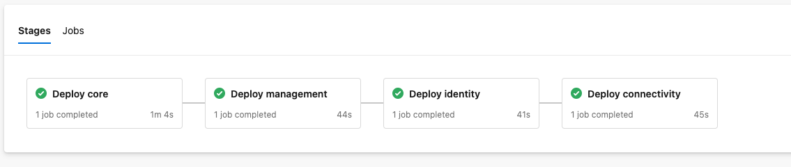
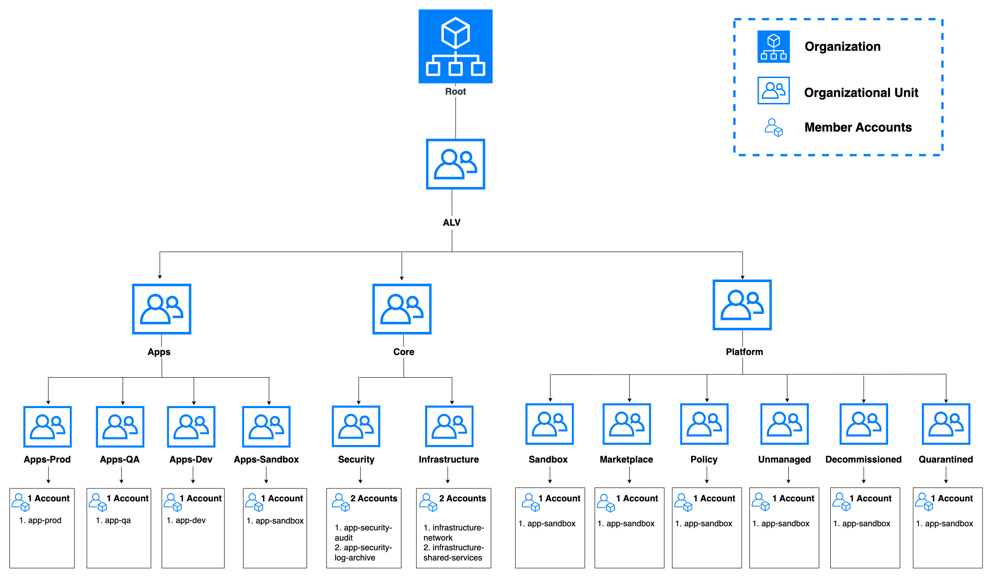

# Introduction

This guide provides detailed instructions for deploying infrastructure on AWS using Terraform and Azure DevOps pipelines. The guide assumes familiarity with AWS services, Terraform, and Azure DevOps.

The project uses an S3 bucket to store Terraform state files and requires an IAM user with specific permissions for deployment. The deployment process is modular, allowing for granular control and easy customization. The infrastructure is divided into several components, including core, management, identity, connectivity and platform, which can be deployed sequentially or through an automated pipeline.

This guide will walk you through setting up the necessary backend and IAM configurations and deploying the infrastructure using both manual and automated methods.

# Table of Content

- [Prerequisites](#prerequisites)
  - [Backend](#s3-bucket)
  - [IAM User](#iam-user)
- [Understanding the Code](#understanding-the-code)
- [Deployment](#deployment)
  - [Pipeline](#pipeline)
- [Resources](#resources)

# Prerequisites

## S3 Bucket

S3 bucket is been used to store state files for this project. You can create the bucket by following the [official article](https://docs.aws.amazon.com/AmazonS3/latest/userguide/create-bucket-overview.html). Ensure to enable [bucket versioning](https://docs.aws.amazon.com/AmazonS3/latest/userguide/manage-versioning-examples.html). The [permission](https://docs.aws.amazon.com/AmazonS3/latest/userguide/access-management.html) needed for the IAM user to the bucket are as follows: -

- s3:ListBucket
- s3:GetObject
- s3:PutObject

The details of the backend should be filled in provider section **provider.tf** of each sub folder under **deploy** folder.

```
backend "s3" {
  bucket = "alv-tfstate"
  key 	 = "state/management.terraform.tfstate"
  region = "ca-central-1"
}
```

## IAM User

An [IAM User](https://docs.aws.amazon.com/IAM/latest/UserGuide/id_users_create.html#id_users_create_console) is required to deploy the resources. The IAM user should have [required permission](https://docs.aws.amazon.com/IAM/latest/UserGuide/id_users_change-permissions.html) to read and write state file and have administrative permission to deploy resources and policy. Note the [credentials](https://docs.aws.amazon.com/cli/v1/userguide/cli-authentication-user.html#cli-authentication-user-get). Example permission looks like below. Please note this is an example permission policy only.

```
{
    "Version": "2012-10-17",
    "Statement": [
        {
            "Sid": "AllowSpecifics",
            "Action": [
                "ec2:*",
                "rds:*",
                "s3:*",
                "sns:*",
                "sqs:*",
                "iam:*",
                "elasticloadbalancing:*",
                "autoscaling:*",
                "cloudwatch:*",
                "cloudfront:*",
                "route53:*",
                "ecr:*",
                "logs:*",
                "ecs:*",
                "application-autoscaling:*",
                "logs:*",
                "events:*",
                "elasticache:*",
                "es:*",
                "kms:*",
                "dynamodb:*"
            ],
            "Effect": "Allow",
            "Resource": "*"
        },
        {
            "Sid": "DenySpecifics",
            "Action": [
                "iam:*User*",
                "iam:*Login*",
                "iam:*Group*",
                "iam:*Provider*",
                "aws-portal:*",
                "budgets:*",
                "directconnect:*",
                "aws-marketplace:*",
                "aws-marketplace-management:*",
                "ec2:*ReservedInstances*"
            ],
            "Effect": "Deny",
            "Resource": "*"
        }
    ]
}
```

The IAM credentials should be exported as Environmental Variables before running Terraform deploy. Or you can use AWS CLI to [authenticate](https://docs.aws.amazon.com/cli/v1/userguide/cli-authentication-user.html) with AWS as this will automatically add the IAM user profile to the system. If AWS CLI is not used, you can export the following key-value in your system.

```
export AWS_ACCESS_KEY_ID="some-access-key"
export AWS_SECRET_ACCESS_KEY="some-secret-key"
export AWS_REGION="ca-central-1"
```

# Understanding the Code

The code is simplified with granular modules for ease of operations. You may change and add resources as per your requirement. Here are files / folder that need mentioning: -

|Folder Name|Description|
|:-----------:|:---------:|
| config| Contains **tfvars** file in sub Folders for each stage of the deployment|
| deploy | Contains terraform main code files in sub folders for each stage of the deployment|
| modules| Contains Terraform Modules|
|.pipelines| Contains Azure DevOps Pipeline YAML file|

**Note : -** You must change values of tfvars and config files as per your organization's policy and naming conventions.

# Deployment

The code can be deployed using [Terraform](https://www.terraform.io/) commands. The sequence of deployment should be **core** --> **management** --> **identity** --> **connectivity** --> **platform**

```
cd  deploy/core
terraform init
terraform plan
terraform apply
```

If you want to deploy the entire code in single go please use [Pipeline](#pipeline).

## Pipeline

The pipeline is defined in YAMl and will work with Azure DevOps Pipeline. Here's how to do it

### Service Connection
Azure DevOps Pipeline requires Service Connection to run tasks. The Service Principle should have access to Key Vault Secrets ([Get and List Permission](https://learn.microsoft.com/en-us/azure/devops/pipelines/release/azure-key-vault?view=azure-devops&tabs=yaml#set-up-azure-key-vault-access-policies)) to retrieve Key Vault Secret Values required during running the task. Please refer to this [official article](https://learn.microsoft.com/en-us/azure/devops/pipelines/library/service-endpoints?view=azure-devops&tabs=yaml#create-a-service-connection) for creating the Service Connection from a Service Principle. Note the following values for a Service Principle from Azure Portal.

|Key Name|Value|
|:---|:---|
|ARM-CLIENT-ID|Application ID of the Service Principle|
|ARM-CLIENT-SECRET|Client Secret of the Service Principle|
|ARM-SUBSCRIPTION-ID|Subscription ID of the Key Vault|
|ARM-TENANT-ID|Azure Tenant ID|

### Key Vault
An Azure Key Vault is required to store Secrets which are used by the pipeline to authenticate against AWS to perform its desired operation. Please note the Service Principle mentioned [above](#service-connection) must have **GET** and **LIST** for the Key Vault Secrets. Please [create the secrets](https://learn.microsoft.com/en-us/azure/key-vault/secrets/quick-create-portal#add-a-secret-to-key-vault) in Azure Key Vault.

Secrets to be created in Azure Key Vault

```
AWS_ACCESS_KEY_ID
AWS_SECRET_ACCESS_KEY
AWS_REGION
```

### Variable Groups
The code needs an Azure DevOps Pipeline Variable Group linked to an existing Azure Key Vault containing the Secrets. Please refer to this [official article](https://learn.microsoft.com/en-us/azure/devops/pipelines/library/variable-groups?view=azure-devops&tabs=yaml#link-secrets-from-an-azure-key-vault) for more details.

Once the above steps are done please change values in **.pipelines/deploy-alz.yml** file

```
variables:
  - name: AZURE_SERVICE_CONNECTION
    value: '<Service Connection Name Here>'
  - group: '<Variable Group Name Here>'
```

### Creating Deploy Pipeline

Please follow this instruction to create the deploy pipeline

- Go to **Pipelines** in Azure DevOps
- Click on **New Pipeline** from right top corner
- Select **Azure Repos Git**
- Select your repository containing this code
- Select **Existing Azure Pipelines YAML file**
- Select the branch and select path as **/.pipelines/deploy-alz.yaml**
- Click on **Continue**
- Click on **Save** from **Run** drop down menu on top right corner
- You may rename the pipeline by choosing **Rename/move** from top right corner Kebab menu

### Running the Deploy Pipeline

Please follow the instruction to run deploy pipelines

- Go to **Pipelines** in Azure DevOps.
- Click on **All** option and click on the deploy pipeline created [above](#creating-deploy-pipeline)
- Click on **Run Pipeline** from top right corner
- Select **Pre Fight Test** as **Yes** and click on **Run** button
- Follow the Pipeline Status

**Note :** - It is recommended to keep **Pre Fight Test** as **Yes** for first time. Once satisfied with the Terraform Plan output you need to rerun the Pipeline keeping **Pre Fight Test** as **No**.



## Resources

The Resources deployed are as follows: -

- Core
  - Organizational Units
  - Accounts
- Management
  - Security Hub
    - Admin Account
    - Standard Subscriptions
    - Finding Aggregator
  - Config
    - S3, Roles, Policy for Config
    - Recorder
    - Delivery Channel
    - Organization Aggregator
    - Conformance Pack
  - Custom Policy
  - Backup vault
- Identity
  - Roles
  - Policy
  - Instance Profile
- Connectivity
  - VPC and Peering
  - Subnets
  - Internet Gateway
  - DHCP Options and Associations
  - Route Table and Associations
  - Network Access Control List and Rules
  - Security Groups
  - VPN Gateway, Customer Gateway and Connection
- Platform
  - Instances for App, Web
  - RDS Instance for Database
  - S3 Buckets

The Organizational Structure deployed in **core** stage is as follows: -

